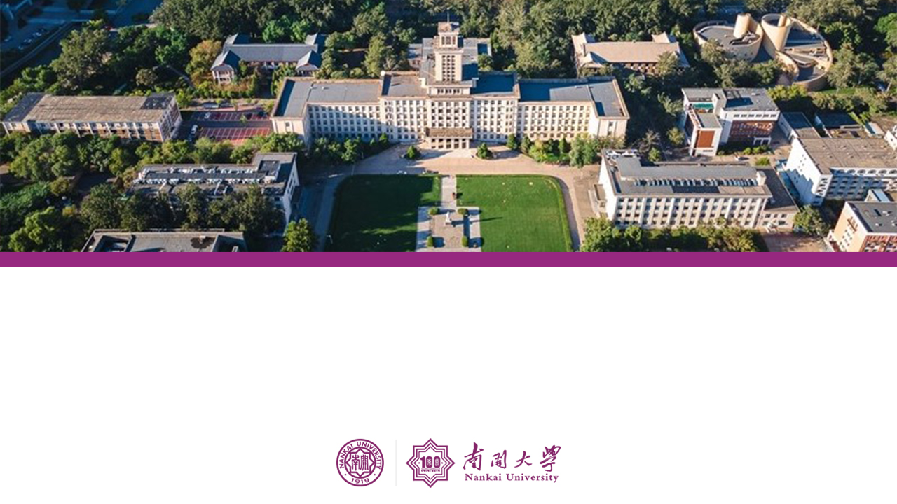

<!-- _paginate: false -->

<style scoped>
    h1{
        margin-top: 180px;
        margin-bottom: 0px;
    }
    h2{
        border-bottom: 5px solid #97267b;
    }
    p{
        margin-top: 80px;
        line-height: 40px;
    }
</style>


# 汇报题目 h1 样式

## 副标题 h2 样式

**Leo**
Nankai University
2022-09-24

---

<!-- _header: 目录 -->


###### 1 Slide 概述
###### 2 文字展示
###### 3 代码展示
###### 4 公式展示
###### 5 表格展示
###### 6 图片展示
###### 7 其它展示
###### 8 参考文献&引用展示

---

<!-- _header: 1 Slide 概述 -->

本 PPT 借助插件 VS Code 插件 Marp 制作，使用 Markdown 语言编写，便于公式和代码的展示与排版。

**环境：**

- 系统：Win10
- 软件：VsCode 插件：Marp
- Theme：自定义主题 NKU

**特征：**

- 每页上方标题栏使用 Marp header 编辑，页面下方参考文献使用 Marp footer 编辑。
- 首尾页和目录页图片基于背景得到，首尾页可根据文字内容在本页修改标题样式，目录页可根据文字内容对图片进行大小位置调整。

---

<!-- _header: 2 文字展示 -->

**h1 h2 只用于首页标题 h6 只用于目录页**
### h3 样式文字
#### h4 样式文字
##### h5 样式文字
**加粗文字 Bold**
普通文字 Normal
*斜体文字 Italic*
~~删除线~~
使用 `<sub>` 与 `<sup>` 标签实现上下标
y=x<sup>3</sup>，H<sub>2</sub>O，Leo et al.<sup>[1]</sup>

---

<!--_header: 3 代码展示 -->

### 行内代码展示

在 PPT 中一般`很少`使用行内代码，因此将其定义为强调关键词，例如 `emphasis here`。

### 代码块展示

**python code**

``` python
# python code 中文注释
import torch
def Net()
    print("Hello Marp!")
```
---

<!--_header: 3 代码展示 -->

**C++ code**

``` C++
//c++ code 中文注释
#include<iostream.h>
#include<string.h>
using namespace std;
int main(
    cout<<"hello world!";
    return 0;
)
```

---

<!--_header: 4 公式展示 -->

行内公式：$123$
行间公式：

$$
D(x) = \begin{cases}
\lim\limits_{x \to 0} \frac{a^x}{b+c}, & x<3 \\
\pi, & x=3 \\
\int_a^{3b}x_{ij}+e^2 \mathrm{d}x,& x>3 \\
\end{cases}
$$

注意：行间公式的编号适配不是很好，加编号会排版错乱

---

<!--_header: 5 表格展示 -->

<style scoped>
    table{
        width: 600px
    }
</style>

使用局部样式，用指定 table 元素 width 的方式设定表格的宽度会比较方便。

|  表头   | 表头  | 表头 |
|  ----  | ----  |--- |
| 单元格  | 单元格 |单元格|
| 单元格  | 单元格 |单元格|

---

<!--_header: 6 图片展示 -->
<!-- _footer: 用 `_footer` 在下方添加参考文献 (Siyuan Hall, *Nankai University*, **Tientsin**) -->

### 普通图片


<note>使用 `<note>` 标签可以为图表添加注解</note>

Siyuan Hall is the most distinctive part of the building is the six Roman columns on the platform.

---

<!--_header: 7 其它展示 -->

### 一些表情

:+1: :-1: :smile: :heart: :cry: :sob: :angry: :grin: :cn:

<br />

### 一些 Font Awesome 图标

<i class="fa fa-camera-retro fa-lg"></i> <i class="fa fa-github fa-lg"></i> <i class="fa fa-mail-reply fa-lg"></i> <i class="fa fa-legal fa-lg"></i> <i class="fa fa-laptop fa-lg"></i> <i class="fa fa-institution fa-lg"></i> <i class="fa fa-cloud fa-lg"></i> <i class="fa fa-car fa-lg"></i>

关于 Font Awesome 图标的使用，请参考 [<i class="fa fa-link fa-lg"></i>link](https://fontawesome.dashgame.com/)

---

<!-- _header: 8 参考文献 & 引用展示 -->

### 一些参考 & 进一步阅读

> - Marp 官方文档 [link](https://marpit.marp.app/markdown)
> - 分栏显示  [link](https://github.com/marp-team/marp/discussions/192)
> - Marp VSCode教程 [link](https://github.com/marp-team/marp-vscode)
> - CAI Marp详细教程博客 [link](https://caizhiyuan.gitee.io/categories/skills/20200730-marp.html#%E5%8A%9F%E8%83%BD)
> - theme gaia 源代码 [link](https://github.com/marp-team/marp-core/blob/main/themes/gaia.scss)
> - theme uncover 源代码 [link](https://github.com/marp-team/marp-core/blob/main/themes/uncover.scss)

---
<style scoped>
    section {
        text-align: center;
    }
    h1{
        color: #701e5e;
        margin-top: 380px
    }
</style>

<!-- _paginate: false  -->



# 请各位老师批评指正

**Leo 2022-9-24**
